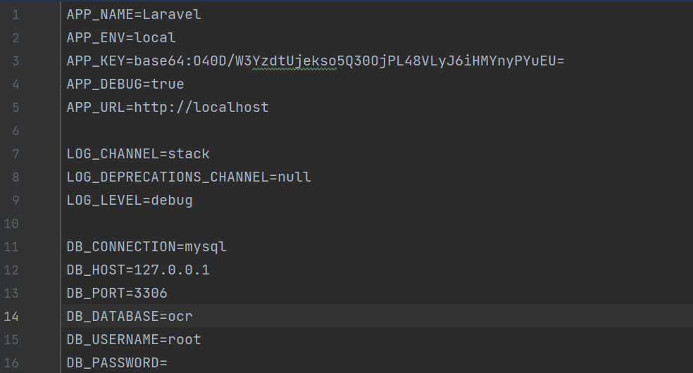
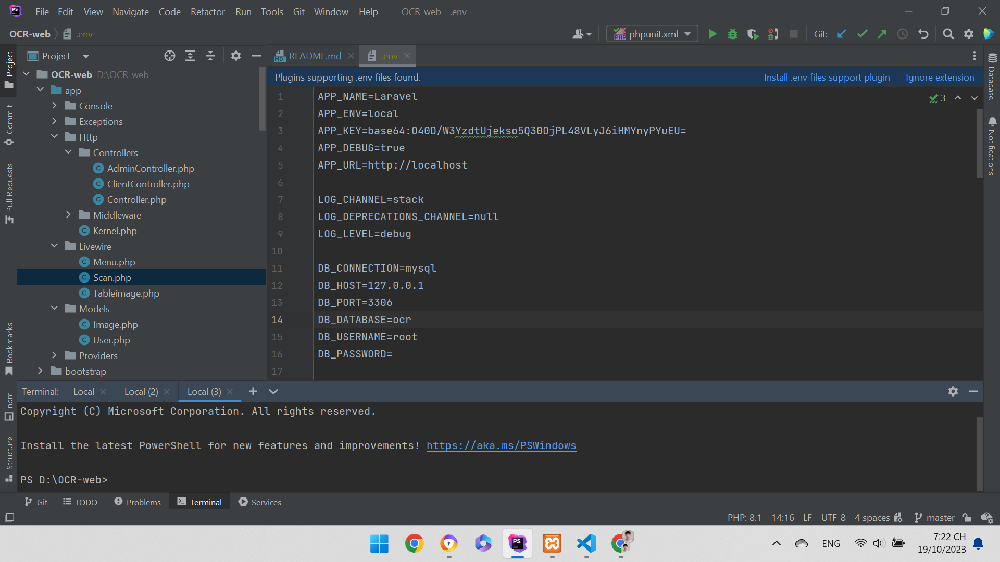

<h3>Sau khi tải xuống các bạn cần khai báo các biến môi trường vào file .env.example sau đó bỏ đuôi .example. Nội dung có thể tham khảo như sau:</h3>

<h3>Tiếp đó bạn nên sử dụng PhpStorm để dễ dàng sử dụng</h3>

<h3>Bạn hãy thực hiện lần lượt các câu lệnh sau</h3>
<h4>Tải các file cần thiết: composer install</h4>
<h4>Tải các file cần thiết: php artisan migrate</h4>
<h4>Tải các file cần thiết: php artisan db:seed</h4>
<h3>Tài khoản đăng nhập trang admin là: admin@gmail.com</h3>
<h3>Mật khẩu: admin123</h3>
<h3>Hãy chắc chắn bạn đã biết cài đặt cơ sở dữ liệu, ví dụ xampp,...
